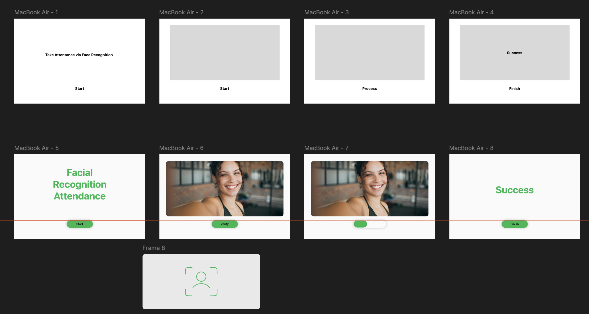

# HW02

Experiments with p5.js, ml5, Teachable Machine

## Facial Recognition Attendance Machine

A web application that could take Bernese Mountain dog attendance.

Developed based on p5.js, ml5.

Figma sketch: 

Presentation Video:
[Video](https://drive.google.com/file/d/1JwJTygmy3J3WXlOqO2j9ig20itQe_MN9/view?usp=sharing)

